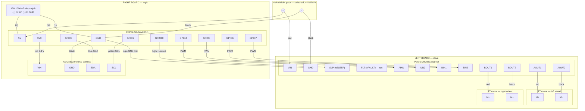

# Fred — wiring schematic

Two-board layout on the octagon chassis: **left board** carries the DRV8833 and
drives the two TT motors; **right board** carries the ESP32-S3 and the AMG8833.
The switched 4xAA NiMH pack (~4.8-5.6 V) sits top middle and feeds both boards
directly — the pack voltage suits the 3-6 V TT motors as-is, and the DevKit's
onboard LDO makes 3.3 V from it, so there is no separate regulator. A bulk
capacitor across the ESP32's 5V/GND rides through the sag when the motors
kick in.

## Wire list

| From | To | Wire | Notes |
|------|----|------|-------|
| Pack + / − | DRV8833 VIN / GND | red / black | motor power, direct |
| Pack + / − | ESP32 5V / GND pins | red / black | onboard LDO makes 3.3 V |
| Capacitor + / − | ESP32 5V / GND pins | — | fit close to the pins; observe polarity |
| ESP32 GPIO4 | DRV8833 AIN1 | any | left motor PWM |
| ESP32 GPIO5 | DRV8833 AIN2 | any | left motor PWM |
| ESP32 GPIO6 | DRV8833 BIN1 | any | right motor PWM |
| ESP32 GPIO7 | DRV8833 BIN2 | any | right motor PWM |
| ESP32 GPIO10 | DRV8833 SLP | any | drive high to enable; low = sleep |
| ESP32 GND | DRV8833 GND | black | **required** — reference for the 5 signal wires |
| ESP32 3V3 | AMG8833 VIN | red | STEMMA QT colours shown |
| ESP32 GND | AMG8833 GND | black | |
| ESP32 GPIO8 | AMG8833 SDA | blue | |
| ESP32 GPIO9 | AMG8833 SCL | yellow | |
| DRV8833 AOUT1/AOUT2 | left motor | red / black | swap to reverse direction |
| DRV8833 BOUT1/BOUT2 | right motor | red / black | swap to reverse direction |

## GPIO summary

| GPIO | Function |
|------|----------|
| 4 | left motor AIN1 (PWM) |
| 5 | left motor AIN2 (PWM) |
| 6 | right motor BIN1 (PWM) |
| 7 | right motor BIN2 (PWM) |
| 8 | I2C SDA (AMG8833) |
| 9 | I2C SCL (AMG8833) |
| 10 | DRV8833 sleep control |

## Notes

- **Common ground.** The two boards must share ground: the pack negative
  already joins them, but run a dedicated ground wire in the bundle with the
  five control wires so the PWM signals have a clean local return.
- **The capacitor matters.** Motor starts and stalls yank the pack voltage
  down through the cells' internal resistance; the bulk cap across the
  ESP32's 5V/GND is what stops that dip resetting the chip. Mount it right
  at the pins, and mind the polarity stripe.
- **NiMH, not alkaline.** NiMH cells sag far less under motor load. If Fred
  ever resets when both motors stall, suspect tired or alkaline cells first.
- **Motor voltage.** TT motors are rated 3-6 V and the pack never exceeds
  that, so full PWM duty is fine.
- **DRV8833 SLP.** The carrier pulls nSLEEP up so the driver is enabled by
  default; wiring it to GPIO10 lets firmware put the driver to sleep. FLT
  (fault output) is left unconnected.
- **USB + battery.** The DevKitC-1's USB 5 V comes in through a diode, so
  having USB and the pack connected at the same time is fine — handy for
  flashing while installed.
